# 类图

类图显示了模型的静态结构，特别是模型中存在的类、类的内部结构以及它们与其他类的关系等。

类图包括类名、属性（Attibute 和 Property）和操作几个部分。

*   类名通常为一个名词，它能够反映类所代表的问题域的概念。

*   Attibute 和 Property 都表示类的属性，但是 Attibute 通常表示在类内部使用的属性，而 Property 通常表示供外部操作的属性。例如，某些属性虽然是 `private` 的，但是提供了相应的 getter/setter 方法供外部操作。

	属性的语法格式为：`[可见性] 属性名:类型[=初始值]`。其中，属性名和类型是必需的，其他部分可选。

*   操作的语法格式为：`可见性 操作名(参数名1:参数类型1, 参数名2:参数类型2, ...):返回值类型`
	
## 可访问性

属性和方法都具有相应的可访问性。可以通过下列符号来定义特定的可访问性。

符号 | 可访问性 
---- | --------
`-` | private
`#` | protected
无  | package(default)
`+` | public

## 静态

要表示 `static` 的属性或方法，需要在属性或方法的定义下面添加一条下划线。下面显示的是一个带有 `static` 属性和方法的类图：

```java
public class User {
	private int age = 20;
	private static String name;
	private String nickname;

	public String getNickname() {
		return nickname;
	}

	public void setNickname(String nickname) {
		this.nickname = nickname;
	}

	public static void run(double speed, double durableTime) {
	}
}
```

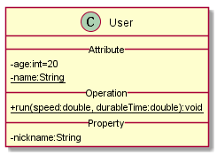

## 抽象类和接口

斜体的类名表示抽象类，斜体的操作定义表示抽象操作。

```java
public abstract class AbstractClass {
	private String name;

	public abstract String abstractMethod(int a, String b);

	public void otherMethod() {
	};
}
```

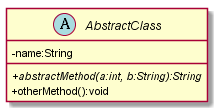

接口是一种特殊的抽象类，所以接口的表达基本语法和类是一样的。

```java
public interface UserEbi {
	boolean createUser(String name, int age);
	
	boolean deleteUser(String name);
}
```

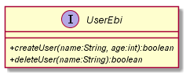

## 类的关系

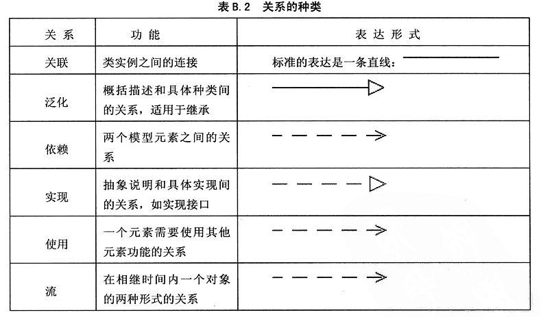

### 关联

关联可以分为以下七种类型：

*   普通关联

*   递归关联

*   限定关联

*   或关联

*   有序关联

*   三元关联

*   聚合关联

#### 普通关联

标准的表示是一条直线，带叉的一端表示关联的发起方，带箭头的一端表示被关联的一方。


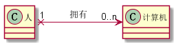

#### 递归关联

如果一个类与它本身有关联关系，那么这种关联关系就称为递归关联。

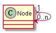

#### 聚合关联

如果类与类之间具有“整体和部分”的关系，使用聚合来表达。根据语义又把聚合关联分成三种：普通聚合、共享聚合和复合聚合（也叫组成）。

**普通聚合**：描述类与类之间具有“整体与部分”的关系。使用连接一端的空心菱形表示具有整体含义的一端。普通聚合是一对多关联。

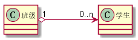

**共享聚合**：如果在聚合关系中，处于部分方的对象参与了多个整体方对象的构成，描述成为共享聚合。共享聚合是多对多关联。

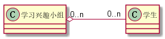

**复合聚合（组成）**：如果构成整体类的部分类，完全隶属于整体类，那么这样的聚合称为复合聚合，也叫组成。在复合聚合中，如果整体对象不存在，那么部分对象也就没有存在的意义了。使用连接一端的实心菱形表示具有整体含义的一端。

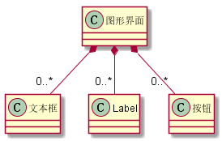

### 依赖

依赖关系：如果某个对象的行为和实现，需要受到另外的对象的影响，那么就说这个对象依赖于其他对象。基本上有关联的地方，严格来说都有依赖。现在最常用的依赖是“使用”，意思是如果 A 使用了 B，那么 A 就依赖于 B。

```java
public class Client {
	public static void main(String[] args) {
		UserEbi user = new UserEbo();
		// ...
	}
}
```

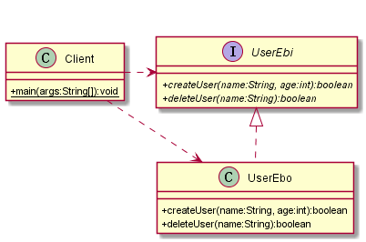

### 泛化

泛化又称为通用化或继承，用来描述一个通用元素的所有信息能被另一个具体元素继承的机制。

```java
public class Person {
	private String name;

	public String getName() {
		return name;
	}

	public void setName(String name) {
		this.name = name;
	}

	public void run() {
	};
}

public class Student extends Person {
	private String studentId;

	public void study() {
	};
}
```

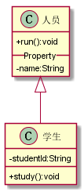

### 实现

描述类实现接口的关系。

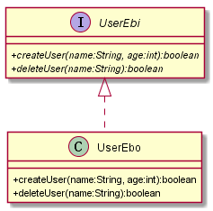