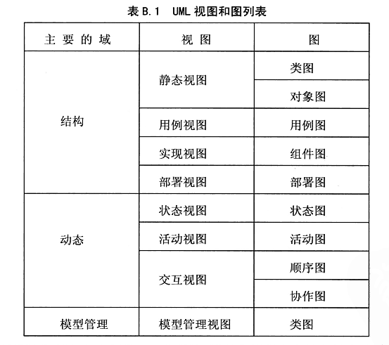

# UML 介绍

UML（Unified Modeling Language，统一建模语言）是一种标准的图形化模型语言，它是面向对象分析与设计的一种标准表示。

UML 在 1997 年被国际化标准组织（OMG）接纳为正式官方标准后已经成为新一代面向对象软件设计的事实标准。

UML 独立于程序设计语言，用 UML 建立的模型可以采用 C++，Java 以及其它任何一种面向对象的程序设计语言来实现。

UML 由视图构成，视图由图构成，图由图片组成，图片是模型元素的符号化。

*   视图：描述完整系统中的一个抽象，用来显示这个系统中的一个特定的方面。

*   图：用来表示系统的一个特殊部分或某个方面。

*   模型元素：所有可以在图中使用的概念统称为模型元素。

在 UML 2.0 里面，视图被分为三个视图域：结构、动态和模型管理，具体如下表：

